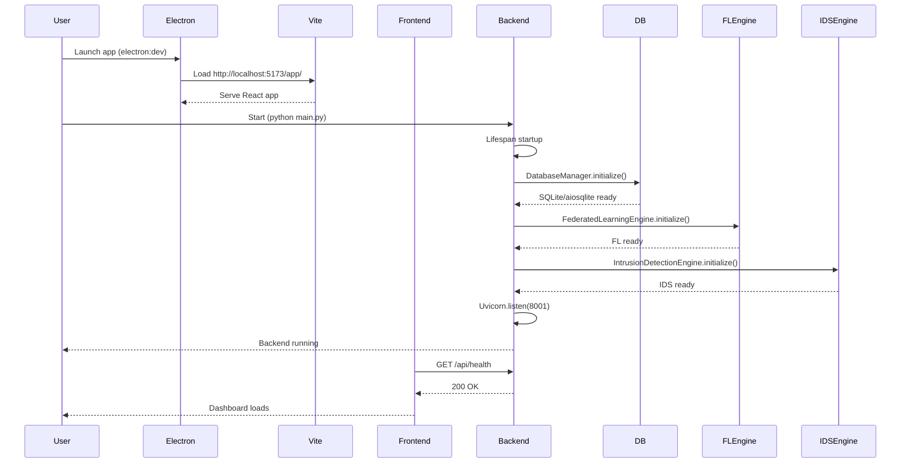
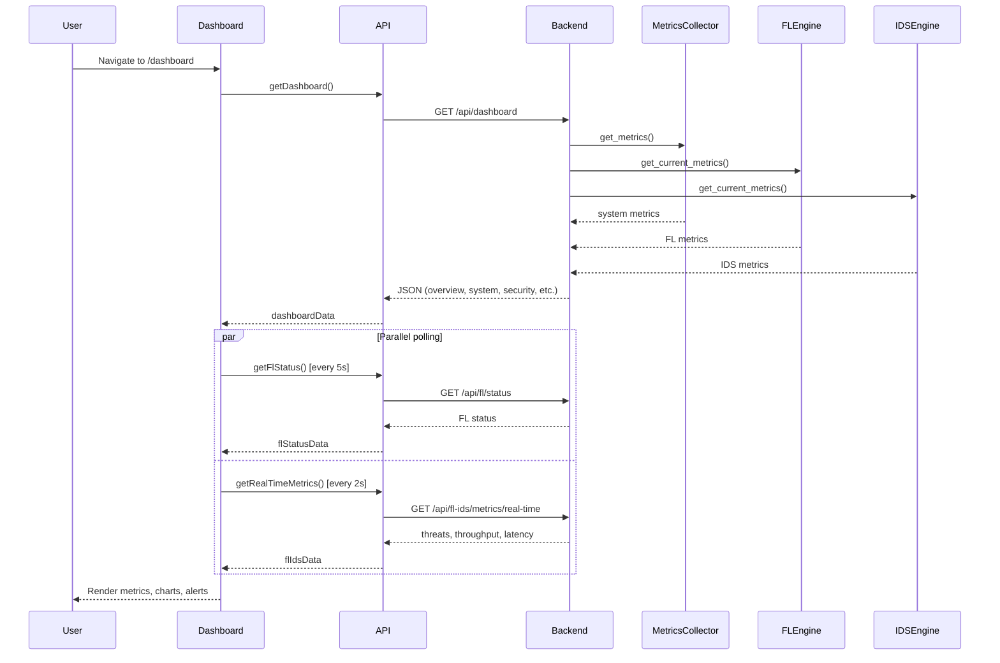
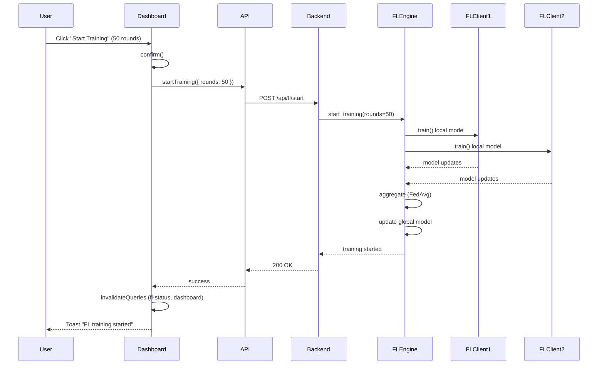
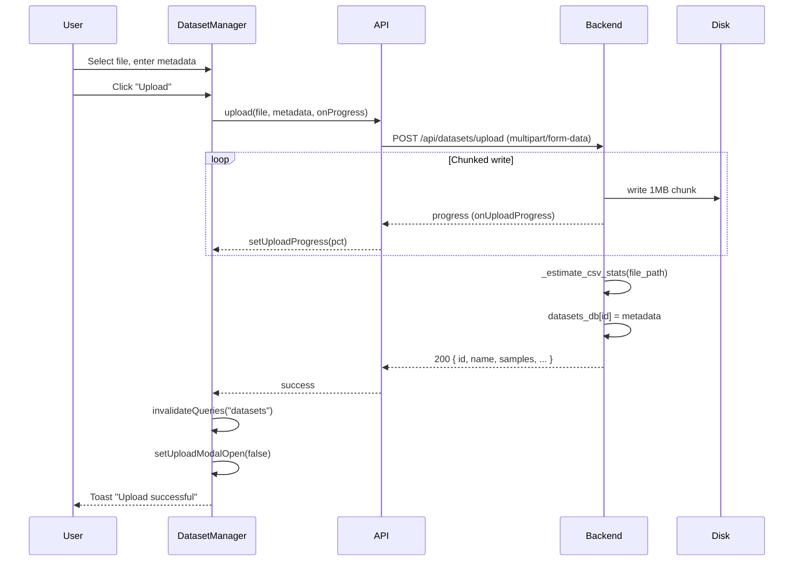
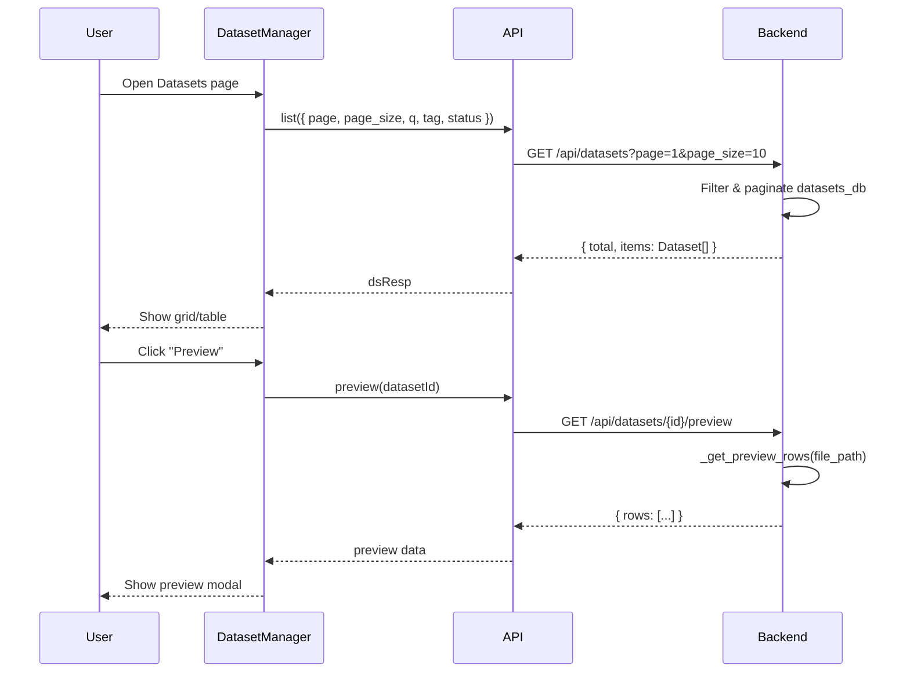
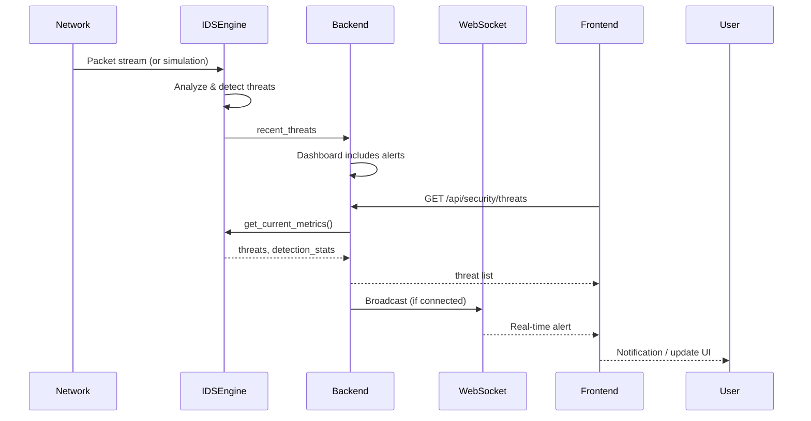
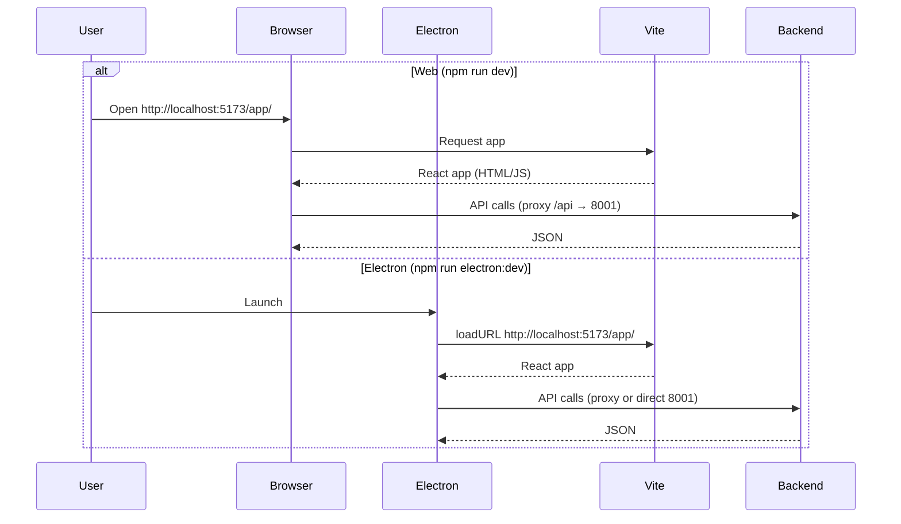

# AgisFL Enterprise – Design Sequence Diagrams

Sequence diagrams for key flows in the FL-IDS platform. Use a [Mermaid](https://mermaid.js.org/) renderer (GitHub, VS Code, etc.) to view.

---

## 1. Application Startup Sequence

---

## 2. Dashboard Load & Real-Time Data Flow

---

## 3. Federated Learning Training Start

---

## 4. Dataset Upload Flow

---

## 5. Dataset List & Preview

---

## 6. Security Monitoring & Alerts

---

## 7. Web Application vs Electron Flow

---

## Component Summary

| Participant      | Role                                                |
|------------------|-----------------------------------------------------|
| **User**         | End user interacting with the application           |
| **Frontend**     | React app (Dashboard, DatasetManager, etc.)         |
| **Electron**     | Desktop shell when running as native app            |
| **Vite**         | Dev server (port 5173), serves frontend             |
| **API**          | Axios client (`frontend/src/services/api.ts`)       |
| **Backend**      | FastAPI (port 8001), routes, lifespan               |
| **FLEngine**     | Federated learning training & aggregation           |
| **IDSEngine**    | Intrusion detection, threat analysis                |
| **MetricsCollector** | System metrics (CPU, memory, etc.)              |
| **DB**           | SQLite via aiosqlite / DatabaseManager              |
